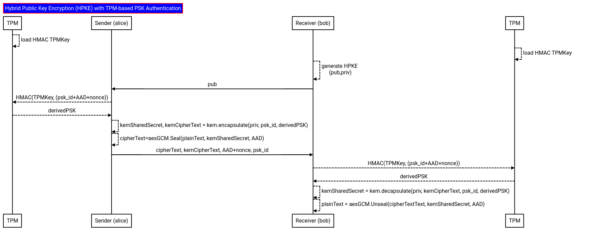

## Hybrid Public Key Encryption (HPKE) with per-message TPM-based PSK Authentication

This repo details a simple application which transfers a key using [Hybrid Public Key Encryption RFC 9180](https://datatracker.ietf.org/doc/rfc9180/) between two parties.

The specific variation described here covers the mode where the encrypted key is also authenticated using a shared `Pre-Shared Key (PSK)` such that the PSK is derived using another root key within a `Trusted Platform Module (TPM)`.

Basically, if Alice wants to send Bob an encrypted message, Alice will use Bob's public key to encapsulate the plaintext.  If Alice and Bob share a PSK and that PSK is encoded irrevocably in hardware, then Alice can attach some authentication data derived from the PSK.  That way, Bob can authenticate the message and know for sure Alice infact sent the message because they can derive the same PSK.

If the message is not authenticated, then Eve  can encrypt some data, give it to Bob and pretend to be Alice.   When a PSK is involved, Eve must have access to that PSK to impersonate the Alice.  However, a PSK is just a key/bytes and can get exfiltrated.   The specific advantage in this repo is an additional layer of trust because the PSK is in hardware on both Alice and Bob and is harder to export.

The basic flow is like this if Alice wants to send Bob an authenticated message

1. Alice and Bob have a `PSK` embedded in a `TPM`
2. Bob generates a `HPKE` Keypair and gives Alice the Public Key
3. Alice creates some Additional Authenticated Data (AAD) plaintext visible on the wire with a random nonce value (eg uuid or timestamp)
4. Alice uses the TPM based key to generate a *new* PSK using `HMAC`:
   `derived_psk=HMAC(TPM_PSK, psk_id+AAD+uuid)`
5. Alice uses the Public key to encrypt a symmetric key which itself encrypts Alice's message.  
   This will provide and encapsulation key (`ek`) and a ciphertext (`ct`)
6. Alice also  attaches the authentication context to the message using the `derived_psk`
7. Alice sends Bob the `ek`, `ct` and the `AAD+uuid` value (the latter in plaintext visible to Eve)
8. Bob will decrypt Alice's message using `ek`, `ct`
9. Bob will use the same `psk_id+AAD+uuid` to arrive at the same `derived_psk` using his TPM
10. Bob will verify the message sent by Alice is authenticated using the this additional data.  
    Note the authentication encompasses Alice's message itself so it authenticated and integrity protected.



>>> NOTE, none of this has been reviewed; its just an idea that needs vetting;  caveat emptor

---

- [Hybrid Public Key Encryption RFC 9180](https://datatracker.ietf.org/doc/rfc9180/)
- [github.com/cloudflare/circl/hpke](https://pkg.go.dev/github.com/cloudflare/circl/hpke)
- [HPKE: Standardizing public-key encryption ](https://blog.cloudflare.com/hybrid-public-key-encryption/)
- [Use of Hybrid Public-Key Encryption (HPKE) with CBOR Object Signing and Encryption (COSE) draft-ietf-cose-hpke-11](https://datatracker.ietf.org/doc/draft-ietf-cose-hpke/)
- [ML-KEM for HPKE draft-connolly-cfrg-hpke-mlkem-04](https://datatracker.ietf.org/doc/draft-connolly-cfrg-hpke-mlkem/)

---


### Setup

To use this, you will need the latest [tpm2_tools](https://github.com/tpm2-software/tpm2-tools) to embed an HMAC key.  To create a new Key

```bash
cd certs/
echo -n "change this password to a secret"  > hkey.dat

printf '\x00\x00' > unique.dat
tpm2_createprimary -C o -G ecc  -g sha256  -c primary.ctx -a "fixedtpm|fixedparent|sensitivedataorigin|userwithauth|noda|restricted|decrypt" -u unique.dat

tpm2_import -C primary.ctx -G hmac -i hkey.dat -u hmac.pub -r hmac.prv
tpm2_flushcontext -t && tpm2_flushcontext -s && tpm2_flushcontext -l  
tpm2_load -C primary.ctx -u hmac.pub -r hmac.prv -c hmac.ctx  
tpm2_flushcontext -t && tpm2_flushcontext -s && tpm2_flushcontext -l  
tpm2_encodeobject -C primary.ctx -u hmac.pub -r hmac.prv -o hmac.pem
```

> note `tpm2_encodeobject` should be from head or from a repo after [issue/3458](https://github.com/tpm2-software/tpm2-tools/issues/3458) is live.


### RUN

The following will generate a keypair, encrypt and decrypt.


```text
## first generate the KEM keypair
$ go run generate/main.go

## Alice encrypts some data
$ go run encrypt/main.go
   Info: public info string, known to both Alice and Bob with nonce da120bec-b4d5-4ff1-b24f-d479e17d4912
   derived PSK: pqej/NpTqEg4rVwpzg/9rfQOblC18J0BHu5bgRkFSwU=

## Bob decrypts
$ go run decrypt/main.go
   Info: public info string, known to both Alice and Bob with nonce da120bec-b4d5-4ff1-b24f-d479e17d4912
   derived PSK: pqej/NpTqEg4rVwpzg/9rfQOblC18J0BHu5bgRkFSwU=
   Decrypted [text encrypted to Bob's public key]

## Alice encrypts more data
$ go run encrypt/main.go
   Info: public info string, known to both Alice and Bob with nonce b11c7252-8ede-49a2-8709-aa234bdfaea5
   derived PSK: VGlvxxQPG9I3bdIsixR+WID1Rc110AH1xeBZ1MrA2fk=

## Bob decrypts
$ go run decrypt/main.go
   Info: public info string, known to both Alice and Bob with nonce b11c7252-8ede-49a2-8709-aa234bdfaea5
   derived PSK: VGlvxxQPG9I3bdIsixR+WID1Rc110AH1xeBZ1MrA2fk=
   Decrypted [text encrypted to Bob's public key]
```

Note that everytime Alice encrypts, the "context" (AAD) data has a unique UUID (or timestamp) attached.  This information generates new derived PSK's to use on every run


---

### References

From [RFC 9180](https://datatracker.ietf.org/doc/rfc9180/)

```
5.  Hybrid Public Key Encryption

   In this section, we define a few HPKE variants.  All variants take a
   recipient public key and a sequence of plaintexts pt and produce an
   encapsulated key enc and a sequence of ciphertexts ct.  These outputs
   are constructed so that only the holder of skR can decapsulate the
   key from enc and decrypt the ciphertexts.  All the algorithms also
   take an info parameter that can be used to influence the generation
   of keys (e.g., to fold in identity information) and an aad parameter
   that provides additional authenticated data to the AEAD algorithm in
   use.

   In addition to the base case of encrypting to a public key, we
   include three authenticated variants: one that authenticates
   possession of a pre-shared key, one that authenticates possession of
   a KEM private key, and one that authenticates possession of both a
   pre-shared key and a KEM private key.  All authenticated variants
   contribute additional keying material to the encryption operation.
   The following one-byte values will be used to distinguish between
   modes:

                         +===============+=======+
                         | Mode          | Value |
                         +===============+=======+
                         | mode_base     | 0x00  |
                         +---------------+-------+
                         | mode_psk      | 0x01  |  <<<<<<<<<<<<<
                         +---------------+-------+


5.1. Creating the Encryption Context
The variants of HPKE defined in this document share a common key schedule that translates the protocol 
inputs into an encryption context. The key schedule inputs are as follows:

  * mode: A one-byte value indicating the HPKE mode, defined in Table 1.
  * shared_secret: A KEM shared secret generated for this transaction.
  * info: Application-supplied information (optional; default value "").
  * psk A pre-shared key (PSK) held by both the sender and the recipient (optional; default value "").
  * psk_id: An identifier for the PSK (optional; default value "").


5.1.2. Authentication Using a Pre-Shared Key

This variant extends the base mechanism by allowing the recipient to authenticate that the sender possessed a given PSK. 

The PSK also improves confidentiality guarantees in certain adversary models, as described in more detail in Section 9.1. 
We assume that both parties have been provisioned with both the PSK value psk and another byte 
string psk_id that is used to identify which PSK should be used.

The primary difference from the base case is that the psk and psk_id values are used as 
ikm inputs to the KDF (instead of using the empty string).
```
